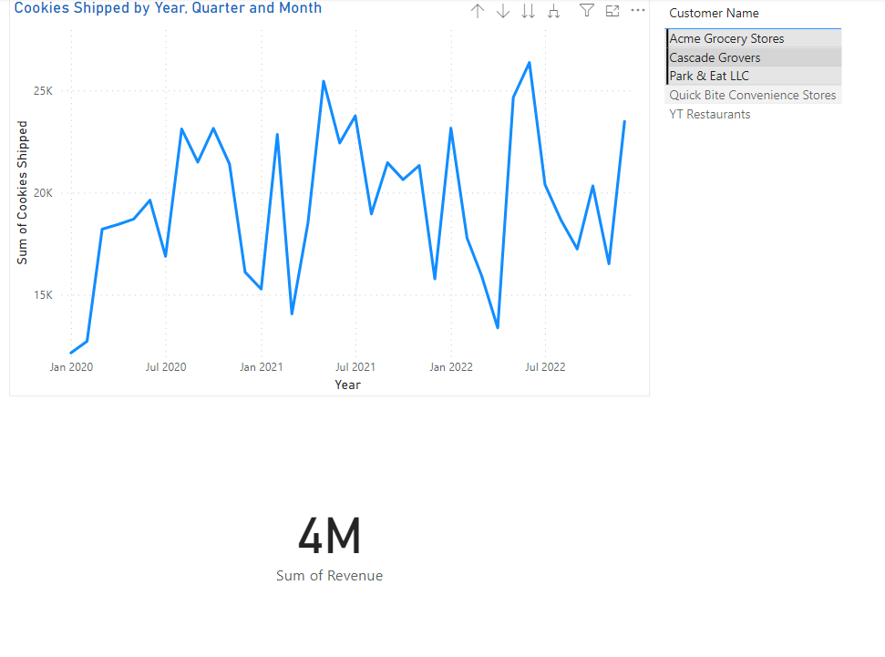

# Cookie Company Data Analysis and Revenue Generation

Welcome to the Cookie Company Data Analysis and Revenue Generation project repository! This repository contains the code and documentation for cleaning, preprocessing, and analyzing data from a cookie making company. The data includes information about customers, orders, and revenue generated.

## Project Overview

In this project, we have performed the following tasks:

1. **Data Cleaning and Preprocessing**: We cleaned and preprocessed the raw data to ensure its quality and consistency. This involved handling missing values, removing duplicates, and standardizing formats.

2. **Database Linking**: We established relationships between different tables using primary and foreign keys to create a comprehensive database schema. This enabled us to effectively analyze the interconnected data.

3. **Data Analysis**: Utilizing the linked data, we conducted various analyses to gain insights into customer behavior, order patterns, and revenue generation trends.

4. **Report Generation**: We utilized Power BI to create visually appealing and informative reports. These reports present key findings and insights derived from the data analysis process.

## Usage

1. **Data Cleaning and Preprocessing**: Use the scripts provided in the `scripts/` directory to clean and preprocess the raw data.

2. **Database Linking**: Utilize the scripts for database linking to establish relationships between different tables based on primary and foreign keys.

3. **Data Analysis**: Run the analysis script to perform various analyses on the linked data.

4. **Report Generation**: Open the Power BI file (`report_generation.pbix`) to view the generated reports and visualizations. Sample screenshots of the reports are provided below.

## Sample Screenshots

## Dependencies

- Python 3.x
- Pandas
- Power BI

## Contributors

- Hamad Rizwan https://github.com/HamadRizwan007

