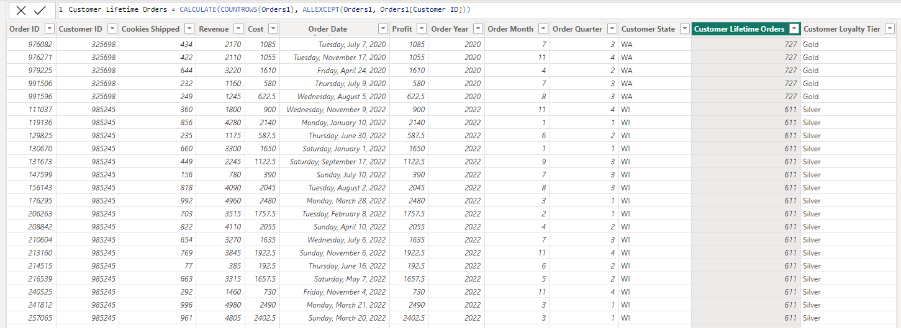
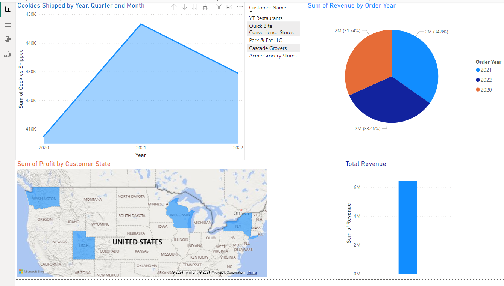

# Cookie Company Data Analysis and Revenue Generation

Welcome to the Cookie Company Data Analysis and Revenue Generation project repository! This repository contains the code and documentation for cleaning, preprocessing, and analyzing data from a cookie making company. The data includes information about customers, orders, and revenue generated.

## Project Overview

In this project, we have performed the following tasks:

1. **Data Cleaning and Preprocessing**: We cleaned and preprocessed the raw data to ensure its quality and consistency. This involved handling missing values, removing duplicates, and standardizing formats.

2. **Database Linking**: We established relationships between different tables using primary and foreign keys to create a comprehensive database schema. This enabled us to effectively analyze the interconnected data.

3. **Data Analysis**: Utilizing the linked data, we conducted various analyses to gain insights into customer behavior, order patterns, and revenue generation trends.

4. **Report Generation**: We utilized Power BI to create visually appealing and informative reports. These reports present key findings and insights derived from the data analysis process.

5. **DAX Queries and Advanced Calculations**: Dive into advanced calculations and queries using DAX (Data Analysis Expressions). Explore the provided DAX query files to understand how to manipulate data effectively.

### Reports

Browse through our collection of Power BI report files (.pbix) showcasing various data analysis and visualization projects. These reports present key insights derived from our data analysis efforts.

### DAX Queries

Explore DAX query files (.dax) demonstrating advanced calculations and queries for data manipulation. These queries are essential for performing complex calculations and extracting meaningful information from your data.

### Data Models

Download Power BI data model files (.pbit) illustrating data relationships, transformations, and modeling techniques. These models serve as a foundation for effective data analysis and visualization.

## Getting Started

To embark on your Power BI data analysis journey, follow these steps:

1. **Install Power BI Desktop**: Download and install Power BI Desktop, the free desktop application for data analysis and visualization.

2. **Explore Sample Reports**: Browse the "Reports" folder in this repository to explore sample Power BI reports and gain insights into data visualization techniques.

3. **Learn DAX Queries**: Study the DAX queries in the "DAX Queries" folder to understand advanced calculations and queries for data manipulation.

4. **Experiment with Data Models**: Download the data model files from the "Data Models" folder to explore data relationships, transformations, and modeling techniques.

5. **Join the Community**: Connect with other Power BI users, share insights, and stay updated on the latest developments in data analysis and visualization by joining the Power BI community.

## Sample Screenshots

## Dependencies

- Python 3.x
- Pandas
- Power BI

## Contributors

- Hamad Rizwan https://github.com/HamadRizwan007

